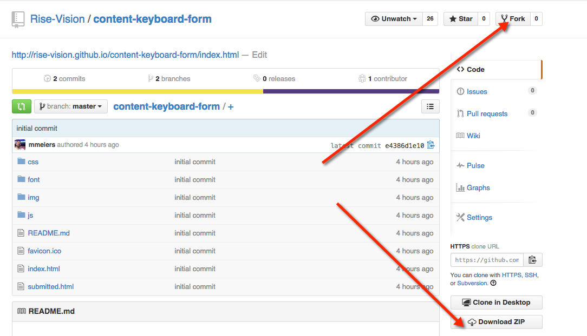
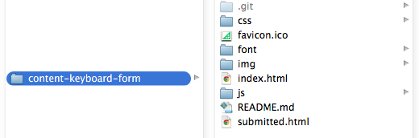
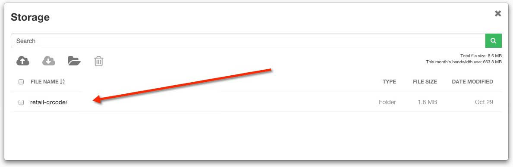
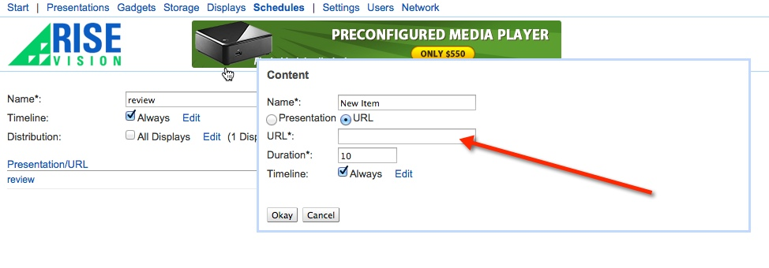

# Keyboard Form Template

## Introduction

This Keyboard Form Template was designed with Materialize.css framework, jQuery4u onscreen keyboard & Formspree form. A preview of the template can be seen here: http://rise-vision.github.io/content-keyboard-form/index.html

##Steps to run the Keyboard Form Template:##
1. Fork or download the entire content-keyboard-form repository.  


2. Modify the files within the content-keyboard-form folder directory to fit your needs (see below on how to modify specific elements).  


3. Host the entire “content-keyboard-form” folder directory in rise vision storage or your web hosting service.  


4. Copy the link to the index.html file where you have it hosted and insert the url into a schedule. (you can also add this link to the url gadget within a presentation)  



##Directions to Modify the Content Keyboard Template:##

####Changing the Material Design Style
The Keyboard Form Template adheres to Google's Material Design Guidelines:
http://www.google.com/design/spec/material-design/introduction.html

The Materialize.css framework was added for easy implementation of various Material Design components such as inputs, buttons and cards. Documentation on how to modify or add more components can be seen here: http://materializecss.com/

####User Input Submission
The Keyboard Form emails the users inputs to an email address configured within the html file using a service called Formspree.io. We are utilizing Formspree to eliminate the need for any server side languages such as php. 

Locate the form tag within the index.html file and follow these three easy steps on Formspree's website: https://formspree.io/

```
<!--Form-->
<form class="col s12" id="contact_form" method="post" action="//formspree.io/mlm@risedisplay.com">
```


####Modifying the Onscreen Keyboard
The onscreen keyboard is a simple on-screen keyboard powered by JavaScript/jQuery built by jQuery4u. The styling can be modified within css/jskeyboard.css and functionality within js/jskeyboard.js. 

Within jskeyboard.css there are 2 media queries
The first one: ```@media (max-width: 1260px)``` turns the visiblitly of the keyboard completely off. This is targeted for phones and tablets that will automatically use their operating system keyboard. ```@media (min-width: 1920px)``` handles screens that have a resolution of 1920x1080 or above and makes the buttons bigger and easier to touch.

The orignial jQuery4u repo is located here:
https://github.com/sdeering/onscreenkeyboard


## Built With
actual tools used
- HTML
- CSS
- Javascript
- Materialize https://github.com/Dogfalo/materialize
- jQuery4u https://github.com/sdeering/onscreenkeyboard
- formspree.io https://github.com/asm-products/formspree

Keyboard Form Template works in conjunction with [Rise Vision](http://www.risevision.com), the [digital signage management application](http://rva.risevision.com/) that runs on [Google Cloud](https://cloud.google.com).

At this time Chrome is the only browser that this project and Rise Vision supports.

## Submitting Issues
If you encounter problems or find defects we really want to hear about them. If you could take the time to add them as issues to this Repository it would be most appreciated. Please Identify the specific template that has the issue and follow the following format where applicable:

**Reproduction Steps**

1. did this
2. then that
3. followed by this (screenshots / video captures always help)

**Expected Results**

What you expected to happen.

**Actual Results**

What actually happened. (screenshots / video captures always help)

## Contributing
All contributions are greatly appreciated and welcome! If you would first like to sound out your contribution ideas please post your thoughts to our [community](http://community.risevision.com), otherwise submit a pull request and we will do our best to incorporate it.

### Suggested Contributions
- Different Styling for Buttons and Keyboard other than Materialize
- Animations for backgrounds or user engagement 
- i18n Language Support

## Resources
If you have any questions or problems please don't hesitate to join our lively and responsive community at http://community.risevision.com.

If you are looking for user documentation on Rise Vision please see http://www.risevision.com/help/users/

If you would like more information on developing applications for Rise Vision please visit http://www.risevision.com/help/developers/.

 If you have any questions or problems please don't hesitate to join our lively and responsive community at http://community.risevision.com.
 
**Additional Content Templates can be found here: https://github.com/Rise-Vision/content-templates**

**Facilitator**

[Mathew Meiers](https://github.com/mmeiers "Mathew Meiers")
